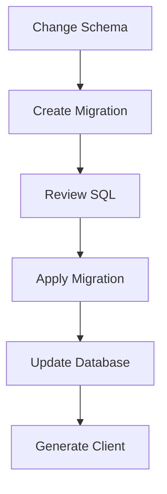

# 🗄️ Database Integration Learning Guide

> Complete guide to understanding database integration with Prisma ORM and SQLite

## 🎯 Table of Contents

1. [Database Fundamentals](#database-fundamentals)
2. [Updated Project Structure](#updated-project-structure)
3. [Prisma ORM Deep Dive](#prisma-orm-deep-dive)
4. [Database Migrations](#database-migrations)
5. [Database Seeding](#database-seeding)
6. [Service Layer Pattern](#service-layer-pattern)
7. [Database Operations (CRUD)](#database-operations-crud)
8. [Error Handling with Database](#error-handling-with-database)
9. [Database Best Practices](#database-best-practices)
10. [Useful Commands](#useful-commands)

---

## 🚀 Database Fundamentals

### What is a Database?

A **database** is a structured collection of data that can be easily accessed, managed, and updated. Think of it as a digital filing cabinet where you store and organize information.

### Why Use a Database Instead of In-Memory Arrays?

| **In-Memory Arrays (Before)**  | **Database (Now)**                         |
| ------------------------------ | ------------------------------------------ |
| ❌ Data lost on server restart | ✅ **Persistent**: Data survives restarts  |
| ❌ Limited to server memory    | ✅ **Scalable**: Can handle large datasets |
| ❌ No concurrent access safety | ✅ **Concurrent**: Multiple users safely   |
| ❌ Manual data validation      | ✅ **Constraints**: Automatic validation   |
| ❌ No relationships            | ✅ **Relational**: Link related data       |
| ❌ No backup/recovery          | ✅ **Reliable**: Backup and recovery       |

### SQLite vs Other Databases

**SQLite** (what we use):

- ✅ **File-based**: No server needed
- ✅ **Zero-config**: Perfect for learning
- ✅ **Lightweight**: Single file database
- ✅ **ACID compliant**: Data integrity guaranteed

**Other databases** (for production):

- **PostgreSQL**: Advanced features, high performance
- **MySQL**: Popular, widely supported
- **MongoDB**: NoSQL, document-based

---

## 🏗️ Updated Project Structure

Our project structure has evolved to include database-related components:

```
src/
├── config/          # Environment & app configuration
├── controllers/     # Business logic & request handlers
├── lib/            # 🆕 Shared utilities & database client
│   └── prisma.ts   # Database connection singleton
├── middleware/      # Custom middleware functions
├── routes/         # Route definitions & URL mapping
├── services/       # 🆕 Database operations & business logic
│   └── userService.ts  # User-related database operations
├── types/          # TypeScript interfaces & types
├── utils/          # Helper functions & utilities
└── index.ts        # Application entry point

prisma/             # 🆕 Database configuration & migrations
├── dev.db          # SQLite database file
├── migrations/     # Version-controlled schema changes
├── schema.prisma   # Database schema definition
└── seed.ts         # Database seeding script
```

### New Directories Explained

#### `src/lib/` - Shared Utilities

**Purpose**: Contains shared utilities and clients that are used across the application.

```typescript
// src/lib/prisma.ts - Database client singleton
import { PrismaClient } from '@prisma/client';

// Singleton pattern ensures one database connection
export const prisma =
	globalForPrisma.prisma ??
	new PrismaClient({
		log: ['query', 'info', 'warn', 'error'], // Debug logging
	});
```

**Why singleton?**

- ⚡ **Performance**: Reuse database connections
- 🔒 **Resource management**: Prevent connection leaks
- 🎯 **Consistency**: Same client instance everywhere

#### `src/services/` - Business Logic Layer

**Purpose**: Contains business logic and database operations, keeping controllers thin.

```typescript
// src/services/userService.ts - User business logic
export class UserService {
	async getAllUsers(): Promise<User[]> {
		return await prisma.user.findMany({
			orderBy: { createdAt: 'desc' },
		});
	}

	async createUser(userData: CreateUserData): Promise<User> {
		return await prisma.user.create({ data: userData });
	}
}
```

**Benefits of Service Layer**:

- 🧹 **Clean controllers**: Controllers focus on HTTP logic
- 🔄 **Reusable logic**: Services can be used from multiple controllers
- 🧪 **Testable**: Easy to unit test business logic
- 📝 **Single responsibility**: Each service handles one domain

#### `prisma/` - Database Configuration

**Purpose**: Contains all database-related files and configurations.

```
prisma/
├── dev.db              # SQLite database file (actual data)
├── migrations/         # Version-controlled schema changes
│   └── 20250926173005_init/
│       └── migration.sql    # SQL commands to create tables
├── schema.prisma       # Database schema definition
└── seed.ts            # Script to populate database with sample data
```

---

## 🔧 Prisma ORM Deep Dive

### What is an ORM?

**ORM** (Object-Relational Mapping) is a technique that lets you query and manipulate data from a database using an object-oriented paradigm.

**Without ORM** (Raw SQL):

```sql
SELECT * FROM users WHERE email = 'john@example.com';
INSERT INTO users (name, email) VALUES ('John', 'john@example.com');
```

**With Prisma ORM** (TypeScript):

```typescript
// Type-safe, auto-completion, compile-time checks
const user = await prisma.user.findUnique({
	where: { email: 'john@example.com' },
});

const newUser = await prisma.user.create({
	data: { name: 'John', email: 'john@example.com' },
});
```

### Prisma Schema

The schema defines your database structure:

```prisma
// prisma/schema.prisma
generator client {
  provider = "prisma-client-js"  // Generate TypeScript client
}

datasource db {
  provider = "sqlite"            // Database type
  url      = env("DATABASE_URL") // Connection string
}

// Database model (table)
model User {
  id        Int      @id @default(autoincrement())  // Primary key
  name      String                                   // Required field
  email     String   @unique                         // Unique constraint
  createdAt DateTime @default(now())                 // Auto timestamp
  updatedAt DateTime @updatedAt                      // Auto-update timestamp

  @@map("users")  // Table name in database
}
```

### Prisma Client Benefits

1. **Type Safety**: Auto-generated TypeScript types
2. **Auto-completion**: IDE support for all operations
3. **Compile-time checks**: Catch errors before runtime
4. **Migration handling**: Automatic schema sync
5. **Query optimization**: Efficient SQL generation

---

## 📊 Database Migrations

### What are Migrations?

**Migrations** are version-controlled scripts that modify your database schema over time. They allow you to:

- 📈 **Evolve schema**: Add/remove tables and columns
- 🔄 **Version control**: Track database changes like code
- 👥 **Team collaboration**: Share schema changes
- 🚀 **Deployment**: Apply changes in production

### Migration Lifecycle



### Our Migration Example

When we ran `npx prisma migrate dev --name init`, Prisma:

1. **Analyzed schema.prisma**
2. **Generated SQL migration**:

   ```sql
   -- prisma/migrations/20250926173005_init/migration.sql
   CREATE TABLE "users" (
       "id" INTEGER NOT NULL PRIMARY KEY AUTOINCREMENT,
       "name" TEXT NOT NULL,
       "email" TEXT NOT NULL,
       "createdAt" DATETIME NOT NULL DEFAULT CURRENT_TIMESTAMP,
       "updatedAt" DATETIME NOT NULL
   );

   CREATE UNIQUE INDEX "users_email_key" ON "users"("email");
   ```

3. **Applied changes to database**
4. **Generated Prisma Client**

### Migration Commands

```bash
# Create and apply new migration
npx prisma migrate dev --name add_user_age

# Apply migrations in production
npx prisma migrate deploy

# Reset database (⚠️ deletes all data)
npx prisma migrate reset

# Check migration status
npx prisma migrate status
```

---

## 🌱 Database Seeding

### What is Database Seeding?

**Seeding** is the process of populating your database with initial or sample data. It's essential for:

- 🧪 **Development**: Test with realistic data
- 🎭 **Demos**: Show features with sample data
- 🧩 **Testing**: Consistent test data
- 🚀 **Production**: Initial system data

### Our Seeding Strategy

```typescript
// prisma/seed.ts
import { PrismaClient } from '@prisma/client';

const prisma = new PrismaClient();

async function main() {
	console.log('🌱 Starting database seeding...');

	// Clear existing data (development only!)
	await prisma.user.deleteMany();
	console.log('📝 Cleared existing users');

	// Create sample users
	const users = await Promise.all([
		prisma.user.create({
			data: {
				name: 'Alice Johnson',
				email: 'alice@example.com',
			},
		}),
		prisma.user.create({
			data: {
				name: 'Bob Wilson',
				email: 'bob@example.com',
			},
		}),
		prisma.user.create({
			data: {
				name: 'Charlie Brown',
				email: 'charlie@example.com',
			},
		}),
	]);

	console.log(`✅ Created ${users.length} users:`);
	users.forEach((user) => {
		console.log(`  - ${user.name} (${user.email})`);
	});

	console.log('🎉 Database seeding completed!');
}

// Error handling and cleanup
main()
	.catch((e) => {
		console.error('❌ Error during seeding:', e);
		process.exit(1);
	})
	.finally(async () => {
		await prisma.$disconnect();
	});
```

### Seeding Best Practices

1. **Idempotent**: Can run multiple times safely
2. **Environment-aware**: Different data for dev/prod
3. **Realistic data**: Use meaningful sample data
4. **Error handling**: Graceful failure handling
5. **Documentation**: Comment complex seeding logic

### Seeding Commands

```bash
# Run seeding manually
npm run db:seed

# Reset database and reseed
npm run db:reset

# Seed automatically after migration
npx prisma migrate dev  # (if configured in package.json)
```

---

## 🔧 Service Layer Pattern

### What is the Service Layer?

The **Service Layer** is a design pattern that encapsulates business logic and database operations, separate from HTTP request handling.

### Architecture Layers

```
┌─────────────────┐
│   Controllers   │  ← HTTP logic, validation, responses
├─────────────────┤
│    Services     │  ← Business logic, database operations
├─────────────────┤
│   Database      │  ← Data persistence
└─────────────────┘
```

### Before vs After Service Layer

**Before** (Fat Controllers):

```typescript
// ❌ Controller doing too much
export const userController = {
	createUser: (req, res, next) => {
		const { name, email } = req.body;

		// Business logic mixed with HTTP logic
		const existingUser = users.find((u) => u.email === email);
		if (existingUser) {
			return next(new AppError('Email exists', 409));
		}

		const newUser = {
			id: Math.max(...users.map((u) => u.id), 0) + 1,
			name,
			email,
			createdAt: new Date().toISOString(),
		};
		users.push(newUser);

		res.status(201).json({ success: true, data: newUser });
	},
};
```

**After** (Thin Controllers + Service Layer):

```typescript
// ✅ Clean separation of concerns

// Service handles business logic
export class UserService {
	async createUser(userData: { name: string; email: string }): Promise<User> {
		return await prisma.user.create({ data: userData });
	}

	async emailExists(email: string): Promise<boolean> {
		const user = await prisma.user.findUnique({ where: { email } });
		return !!user;
	}
}

// Controller handles HTTP logic
export const userController = {
	createUser: async (req, res, next) => {
		try {
			const { name, email } = req.body;

			// Check business rule
			if (await userService.emailExists(email)) {
				return next(new AppError('Email exists', 409));
			}

			// Execute business operation
			const newUser = await userService.createUser({ name, email });

			// Format HTTP response
			res.status(201).json({
				success: true,
				message: 'User created successfully',
				data: newUser,
			});
		} catch (error) {
			next(error);
		}
	},
};
```

### Service Layer Benefits

1. **🧹 Clean Controllers**: Focus on HTTP concerns only
2. **🔄 Reusable Logic**: Use same service from multiple controllers
3. **🧪 Testable**: Easy to unit test business logic
4. **📝 Single Responsibility**: Each service handles one domain
5. **🎯 Maintainable**: Changes isolated to specific layers

---

## 💾 Database Operations (CRUD)

### Prisma CRUD Operations

#### **Create** - Adding New Records

```typescript
// Single record
const user = await prisma.user.create({
	data: {
		name: 'John Doe',
		email: 'john@example.com',
	},
});

// Multiple records
const users = await prisma.user.createMany({
	data: [
		{ name: 'Alice', email: 'alice@example.com' },
		{ name: 'Bob', email: 'bob@example.com' },
	],
});
```

#### **Read** - Retrieving Records

```typescript
// Find all users
const allUsers = await prisma.user.findMany();

// Find with conditions
const recentUsers = await prisma.user.findMany({
	where: {
		createdAt: {
			gte: new Date('2024-01-01'), // Greater than or equal
		},
	},
	orderBy: {
		createdAt: 'desc',
	},
	take: 10, // Limit to 10 records
});

// Find unique record
const user = await prisma.user.findUnique({
	where: { email: 'john@example.com' },
});

// Find first match
const firstUser = await prisma.user.findFirst({
	where: { name: { contains: 'John' } },
});
```

#### **Update** - Modifying Records

```typescript
// Update single record
const updatedUser = await prisma.user.update({
	where: { id: 1 },
	data: { name: 'John Updated' },
});

// Update multiple records
const updatedUsers = await prisma.user.updateMany({
	where: { name: { contains: 'test' } },
	data: { name: 'Updated Name' },
});

// Upsert (update or create)
const upsertedUser = await prisma.user.upsert({
	where: { email: 'john@example.com' },
	update: { name: 'John Updated' },
	create: { name: 'John', email: 'john@example.com' },
});
```

#### **Delete** - Removing Records

```typescript
// Delete single record
const deletedUser = await prisma.user.delete({
	where: { id: 1 },
});

// Delete multiple records
const deletedUsers = await prisma.user.deleteMany({
	where: { name: { contains: 'test' } },
});

// Delete all records (⚠️ dangerous!)
await prisma.user.deleteMany();
```

### Advanced Query Features

#### **Filtering**

```typescript
const users = await prisma.user.findMany({
	where: {
		AND: [{ name: { contains: 'John' } }, { email: { endsWith: '@example.com' } }],
		OR: [{ createdAt: { gte: new Date('2024-01-01') } }, { name: { equals: 'Admin' } }],
		NOT: {
			email: { contains: 'spam' },
		},
	},
});
```

#### **Sorting and Pagination**

```typescript
const users = await prisma.user.findMany({
	orderBy: [{ createdAt: 'desc' }, { name: 'asc' }],
	skip: 20, // Offset
	take: 10, // Limit
});
```

#### **Field Selection**

```typescript
// Select specific fields only
const users = await prisma.user.findMany({
	select: {
		id: true,
		name: true,
		email: true,
		// createdAt and updatedAt excluded
	},
});
```

---

## ⚠️ Error Handling with Database

### Common Database Errors

#### **Unique Constraint Violations**

```typescript
try {
	const user = await prisma.user.create({
		data: { name: 'John', email: 'existing@example.com' },
	});
} catch (error) {
	if (error instanceof Prisma.PrismaClientKnownRequestError) {
		if (error.code === 'P2002') {
			// Unique constraint failed
			return next(new AppError('Email already exists', 409));
		}
	}
	throw error;
}
```

#### **Record Not Found**

```typescript
try {
	const user = await prisma.user.update({
		where: { id: 999 },
		data: { name: 'Updated' },
	});
} catch (error) {
	if (error instanceof Prisma.PrismaClientKnownRequestError) {
		if (error.code === 'P2025') {
			// Record not found
			return next(new AppError('User not found', 404));
		}
	}
	throw error;
}
```

### Error Handling Patterns

#### **Service Level Error Handling**

```typescript
export class UserService {
	async updateUser(id: number, updates: UpdateUserData): Promise<User | null> {
		// Check existence first (safer approach)
		const existingUser = await this.getUserById(id);
		if (!existingUser) {
			return null; // Let controller handle the 404
		}

		try {
			return await prisma.user.update({
				where: { id },
				data: updates,
			});
		} catch (error) {
			// Handle database-specific errors
			if (error instanceof Prisma.PrismaClientKnownRequestError) {
				if (error.code === 'P2002') {
					throw new Error('Email already exists');
				}
			}
			throw error; // Re-throw unknown errors
		}
	}
}
```

#### **Controller Level Error Handling**

```typescript
export const userController = {
	updateUser: async (req, res, next) => {
		try {
			const updatedUser = await userService.updateUser(id, updates);

			if (!updatedUser) {
				return next(new AppError('User not found', 404));
			}

			res.json({ success: true, data: updatedUser });
		} catch (error) {
			// Transform service errors to HTTP errors
			if (error.message === 'Email already exists') {
				return next(new AppError('Email already exists', 409));
			}
			next(error); // Let global error handler deal with it
		}
	},
};
```

---

## 🎯 Database Best Practices

### 1. **Connection Management**

```typescript
// ✅ DO: Use singleton pattern
export const prisma = globalForPrisma.prisma ?? new PrismaClient();

// ❌ DON'T: Create multiple clients
const prisma1 = new PrismaClient(); // Bad
const prisma2 = new PrismaClient(); // Bad
```

### 2. **Query Optimization**

```typescript
// ✅ DO: Select only needed fields
const users = await prisma.user.findMany({
	select: { id: true, name: true, email: true },
});

// ❌ DON'T: Select everything when not needed
const users = await prisma.user.findMany(); // Gets all fields
```

### 3. **Error Handling**

```typescript
// ✅ DO: Handle specific database errors
if (error instanceof Prisma.PrismaClientKnownRequestError) {
	if (error.code === 'P2002') {
		// Handle unique constraint
	}
}

// ❌ DON'T: Ignore database errors
try {
	await prisma.user.create(data);
} catch (error) {
	// Ignoring error - bad!
}
```

### 4. **Validation**

```typescript
// ✅ DO: Validate at multiple layers
// 1. Input validation (Joi)
// 2. Business logic validation (Service)
// 3. Database constraints (Schema)

// ❌ DON'T: Rely only on database constraints
```

### 5. **Transactions** (Advanced)

```typescript
// ✅ DO: Use transactions for multiple related operations
await prisma.$transaction(async (tx) => {
	const user = await tx.user.create({ data: userData });
	await tx.profile.create({ data: { userId: user.id, ...profileData } });
});
```

---

## 🛠️ Useful Commands

### Database Commands

```bash
# 🗃️ Database Management
npm run db:seed          # Populate with sample data
npm run db:reset         # Reset and reseed database
npx prisma migrate dev   # Create and apply migration
npx prisma migrate reset # Reset all migrations (⚠️ destructive)

# 🔍 Database Inspection
npx prisma studio        # Visual database browser (http://localhost:5555)
npx prisma db pull       # Generate schema from existing database
npx prisma db push       # Push schema changes without migration

# 🔧 Development Tools
npx prisma generate      # Regenerate Prisma client
npx prisma validate      # Validate schema file
npx prisma format        # Format schema file
```

### Development Workflow

```bash
# 1. Modify schema
vim prisma/schema.prisma

# 2. Create migration
npx prisma migrate dev --name add_user_age

# 3. Seed database (if needed)
npm run db:seed

# 4. Start development server
npm run dev
```

### Database File Locations

```bash
# SQLite database file
prisma/dev.db

# View database with external tool
sqlite3 prisma/dev.db
.tables              # List tables
.schema users        # Show table schema
SELECT * FROM users; # Query data
.quit               # Exit
```

---

## 🎓 What You've Learned

### Database Concepts

- ✅ **Persistence**: Data survives application restarts
- ✅ **ACID Properties**: Atomicity, Consistency, Isolation, Durability
- ✅ **Constraints**: Unique emails, required fields, data types
- ✅ **Indexes**: Fast lookups (email unique index)
- ✅ **Migrations**: Version-controlled schema changes
- ✅ **Seeding**: Sample data for development

### Architecture Patterns

- ✅ **Service Layer**: Separation of business logic
- ✅ **Repository Pattern**: Data access abstraction (via Prisma)
- ✅ **Singleton Pattern**: Single database connection
- ✅ **Error Handling**: Database-specific error management

### Prisma ORM Features

- ✅ **Type Safety**: Auto-generated TypeScript types
- ✅ **Query Builder**: Fluent API for database operations
- ✅ **Migration System**: Schema versioning and deployment
- ✅ **Client Generation**: Optimized database client
- ✅ **Studio**: Visual database management

### Development Workflow

- ✅ **Schema Design**: Define data models in Prisma schema
- ✅ **Migration Creation**: Version control schema changes
- ✅ **Database Seeding**: Populate with test data
- ✅ **CRUD Operations**: Create, Read, Update, Delete
- ✅ **Error Handling**: Graceful database error management

---

## 🚀 Next Steps

### Immediate Learning

1. **Try Prisma Studio**: `npx prisma studio` for visual exploration
2. **Add Relations**: Create related models (Users → Posts)
3. **Complex Queries**: Filtering, sorting, pagination
4. **Database Indexes**: Improve query performance

### Advanced Topics

1. **Transactions**: Ensure data consistency
2. **Database Optimization**: Query performance
3. **Backup & Recovery**: Data protection
4. **Production Deployment**: PostgreSQL/MySQL migration
5. **Connection Pooling**: Handle high traffic
6. **Database Monitoring**: Performance metrics

### Project Extensions

1. **Add more models**: Posts, Comments, Categories
2. **Implement relationships**: One-to-many, many-to-many
3. **Add pagination**: Handle large datasets
4. **Implement search**: Full-text search capabilities
5. **Add audit logs**: Track data changes

You now have a solid foundation in database integration with Express.js! 🎉
